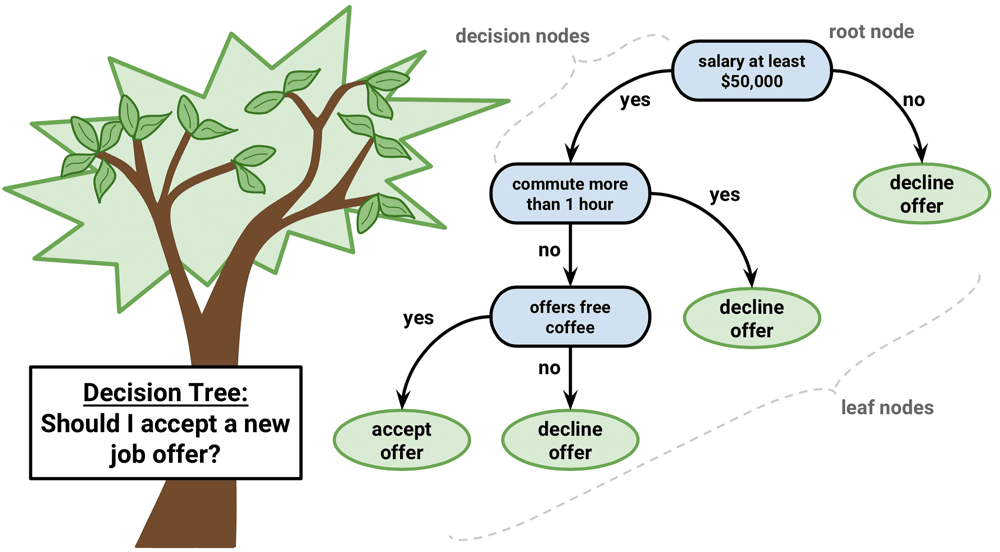
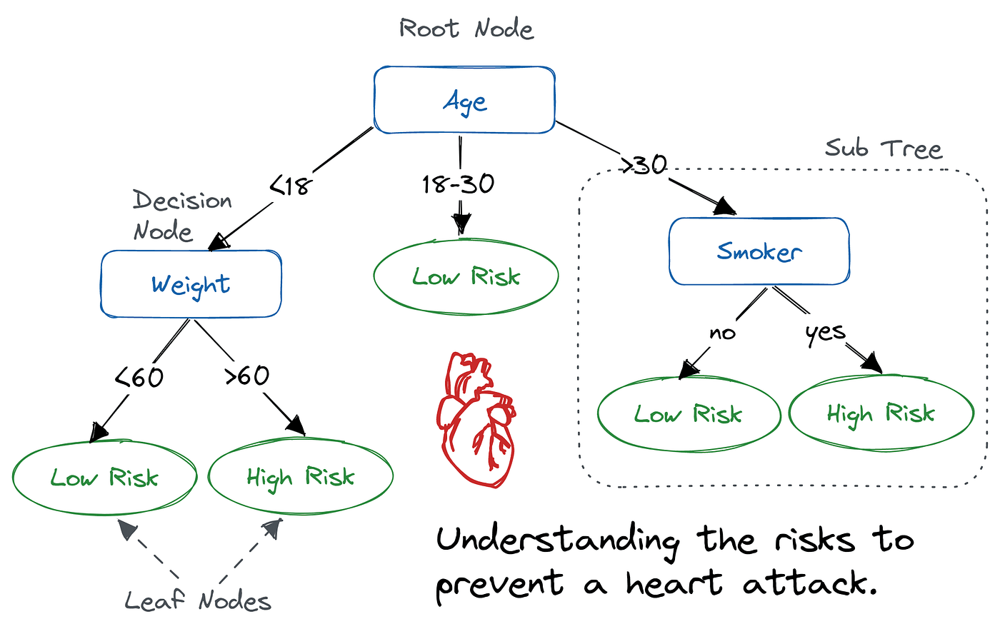

# 🌳 Decision Trees

A **Decision Tree** is a supervised machine learning algorithm that makes decisions by splitting data into branches based on feature conditions — just like a flowchart. It's one of the most intuitive and interpretable ML models.

---

## 🧠 Intuition — Real World Example

Before diving into ML, consider this everyday scenario:

> _"Should I accept a new job offer?"_



You naturally ask yourself a series of questions:

- Is the salary at least $50,000? → If **no**, decline.
- Is the commute more than 1 hour? → If **yes**, decline.
- Does the office offer free coffee? → If **yes**, accept!

This chain of yes/no questions **is** a decision tree. ML uses the exact same logic — but learns the questions automatically from data.

---

## 🏗️ Anatomy of a Decision Tree



The diagram above shows a medical decision tree for predicting **heart attack risk** based on Age, Weight, and Smoking status.

| Component         | Description                                                                 |
| ----------------- | --------------------------------------------------------------------------- |
| **Root Node**     | The topmost node; represents the best splitting feature (e.g., _Age_)       |
| **Decision Node** | An internal node that splits data further (e.g., _Weight_, _Smoker_)        |
| **Leaf Node**     | A terminal node with the final output/class (e.g., _Low Risk_, _High Risk_) |
| **Branch / Edge** | The condition/rule that connects nodes (e.g., `< 18`, `> 30`, `yes/no`)     |
| **Sub Tree**      | A smaller tree rooted at a decision node within the main tree               |

---

## 🔄 How a Decision Tree Works

```
1. Start at the Root Node
2. Evaluate the condition at the current node
3. Follow the branch that matches the condition
4. Repeat at the next Decision Node
5. Stop when a Leaf Node is reached → that's your prediction
```

### Example — Heart Attack Risk Prediction

```
Patient: Age = 35, Smoker = Yes

Step 1 → Root Node: Age > 30? ✅ Yes → go right (Sub Tree)
Step 2 → Decision Node: Smoker? → Yes
Step 3 → Leaf Node: HIGH RISK ⚠️
```

---

## 📐 How the Tree Learns — Splitting Criteria

The algorithm chooses the **best feature** to split on at each node by maximizing information gain or minimizing impurity.

### Gini Impurity

Measures how often a randomly chosen element would be incorrectly classified.

```
Gini = 1 - Σ(pᵢ²)
```

- `pᵢ` = probability of class `i` in the node
- **Gini = 0** → perfectly pure node (all same class)
- **Gini = 0.5** → maximum impurity (50/50 split)

### Entropy & Information Gain

```
Entropy H(S) = -Σ pᵢ log₂(pᵢ)

Information Gain = H(parent) - weighted_avg H(children)
```

The split with the **highest Information Gain** is chosen.

---

## ⚙️ Building a Decision Tree (Python)

```python
from sklearn.tree import DecisionTreeClassifier
from sklearn.model_selection import train_test_split
from sklearn.metrics import accuracy_score
import pandas as pd

# Sample dataset
data = {
    'Age':    [25, 35, 45, 17, 22, 50, 28, 40],
    'Weight': [55, 70, 80, 45, 60, 90, 65, 75],
    'Smoker': [ 0,  1,  1,  0,  0,  1,  0,  1],
    'Risk':   [ 0,  1,  1,  0,  0,  1,  0,  1]  # 0=Low, 1=High
}
df = pd.DataFrame(data)

X = df[['Age', 'Weight', 'Smoker']]
y = df['Risk']

X_train, X_test, y_train, y_test = train_test_split(X, y, test_size=0.25)

# Train
model = DecisionTreeClassifier(criterion='gini', max_depth=3)
model.fit(X_train, y_train)

# Predict
preds = model.predict(X_test)
print(f"Accuracy: {accuracy_score(y_test, preds):.2f}")
```

### Visualizing the Tree

```python
from sklearn.tree import plot_tree
import matplotlib.pyplot as plt

plt.figure(figsize=(12, 6))
plot_tree(model, feature_names=['Age', 'Weight', 'Smoker'],
          class_names=['Low Risk', 'High Risk'], filled=True)
plt.show()
```

---

## ✅ Advantages & ❌ Disadvantages

| ✅ Advantages                             | ❌ Disadvantages                                 |
| ----------------------------------------- | ------------------------------------------------ |
| Easy to visualize & interpret             | Prone to **overfitting** on deep trees           |
| No feature scaling needed                 | Sensitive to small data changes                  |
| Handles both numerical & categorical data | Can create **biased trees** with imbalanced data |
| Fast predictions                          | Less accurate than ensemble methods              |
| Non-linear relationships handled well     | Unstable (high variance)                         |

---

## 🌲 Controlling Tree Complexity

To prevent overfitting, limit the tree using **hyperparameters**:

```python
DecisionTreeClassifier(
    max_depth=5,          # Max depth of the tree
    min_samples_split=10, # Min samples required to split a node
    min_samples_leaf=5,   # Min samples required at a leaf node
    max_features='sqrt'   # Number of features to consider per split
)
```

---

## 🚀 Beyond Decision Trees — Ensemble Methods

Decision Trees are the building blocks of powerful ensemble algorithms:

| Algorithm              | How It Uses Trees                                         |
| ---------------------- | --------------------------------------------------------- |
| **Random Forest**      | Trains many trees on random subsets; averages results     |
| **Gradient Boosting**  | Trains trees sequentially; each corrects the previous     |
| **XGBoost / LightGBM** | Optimized gradient boosting; state-of-the-art performance |
| **AdaBoost**           | Weights misclassified samples higher each round           |

---

## 📝 Quick Summary

```
Decision Tree
│
├── Root Node       → Best feature to split on first
├── Decision Nodes  → Intermediate splits on features
├── Branches        → Conditions (e.g., age > 30, smoker = yes)
└── Leaf Nodes      → Final predictions (Low Risk / High Risk)

Learning: Maximize Information Gain (or minimize Gini Impurity)
Task:     Classification or Regression
Type:     Supervised Learning
```

---

> 💡 **Tip:** A single decision tree is great for interpretability, but for better accuracy use **Random Forest** or **XGBoost** in production!
