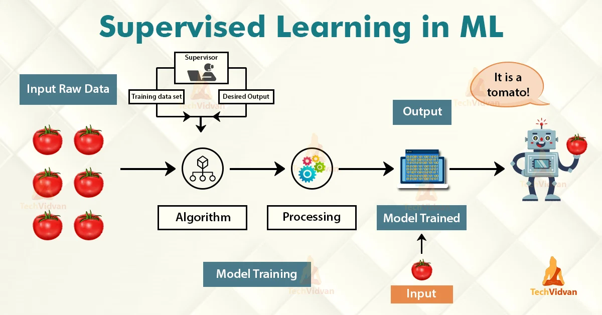
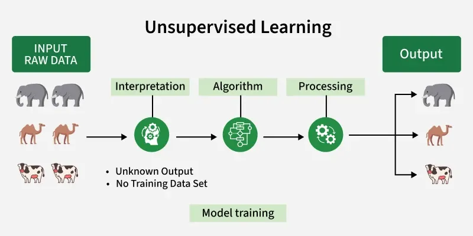

# 🤖 Machine Learning

Machine Learning (ML) is a subset of Artificial Intelligence that enables systems to **learn from data** and improve their performance over time — without being explicitly programmed.

---

## 📌 Types of Machine Learning

| Type                   | Training Data | Output Known?      |
| ---------------------- | ------------- | ------------------ |
| Supervised Learning    | Labeled       | ✅ Yes             |
| Unsupervised Learning  | Unlabeled     | ❌ No              |
| Reinforcement Learning | Reward-based  | ⚡ Feedback-driven |

---

## 1. 🏷️ Supervised Learning

In **Supervised Learning**, the model is trained on a **labeled dataset** — meaning every input has a corresponding correct output. A "supervisor" guides the model by providing both the training data and the desired output.



### How It Works

1. **Input Raw Data** is fed into the system (e.g., images of tomatoes)
2. A **Supervisor** provides a labeled training dataset with desired outputs
3. An **Algorithm** learns the mapping between inputs and outputs
4. **Processing** refines the model weights
5. The **Model is Trained** and can now predict on new inputs
6. Given a new tomato image → the model outputs: _"It is a tomato!"_

### Key Characteristics

- Requires **labeled training data**
- Output is **known in advance**
- Model learns a mapping: `f(X) → Y`

### Common Algorithms

- Linear / Logistic Regression
- Decision Trees & Random Forests
- Support Vector Machines (SVM)
- Neural Networks

### Use Cases

- Email spam detection
- Image classification
- Medical diagnosis
- Price prediction

---

## 2. 🔍 Unsupervised Learning

In **Unsupervised Learning**, the model is given **raw, unlabeled data** and must discover hidden patterns or structures on its own — with no predefined output to guide it.



### How It Works

1. **Input Raw Data** is fed in with **no labels** (e.g., mixed images of elephants, camels, cows)
2. The system **interprets** the data
3. An **Algorithm** detects patterns and similarities
4. **Processing** groups the data based on features
5. **Output** — the model clusters similar items together automatically

### Key Characteristics

- **No labeled training data** required
- Output is **unknown beforehand**
- Model finds structure independently

### Common Algorithms

- K-Means Clustering
- Hierarchical Clustering
- Principal Component Analysis (PCA)
- Autoencoders

### Use Cases

- Customer segmentation
- Anomaly detection
- Recommendation systems
- Data compression

---

## ⚖️ Supervised vs Unsupervised Learning

| Feature               | Supervised     | Unsupervised      |
| --------------------- | -------------- | ----------------- |
| **Labels**            | Required       | Not required      |
| **Goal**              | Predict output | Find patterns     |
| **Complexity**        | Lower          | Higher            |
| **Human involvement** | High           | Low               |
| **Example**           | Spam filter    | Customer grouping |

---

## 🧠 Key ML Concepts

### Training vs Testing

- **Training Set** — data used to teach the model
- **Test Set** — unseen data used to evaluate performance

### Overfitting & Underfitting

- **Overfitting** — model memorizes training data but fails on new data
- **Underfitting** — model is too simple to capture the underlying pattern

### Model Evaluation Metrics

- **Accuracy** — % of correct predictions
- **Precision & Recall** — useful for imbalanced datasets
- **F1 Score** — harmonic mean of precision and recall
- **Loss / Cost Function** — measures prediction error during training

---

## 🚀 Getting Started with ML (Python)

```python
# Simple Supervised Learning Example
from sklearn.datasets import load_iris
from sklearn.model_selection import train_test_split
from sklearn.ensemble import RandomForestClassifier
from sklearn.metrics import accuracy_score

# Load data
data = load_iris()
X, y = data.data, data.target

# Split
X_train, X_test, y_train, y_test = train_test_split(X, y, test_size=0.2)

# Train
model = RandomForestClassifier()
model.fit(X_train, y_train)

# Evaluate
predictions = model.predict(X_test)
print(f"Accuracy: {accuracy_score(y_test, predictions):.2f}")
```

---
